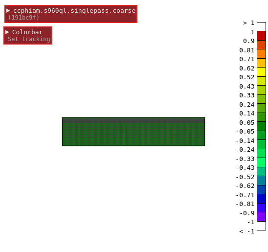

# The platt backend #

This program displays the results of finite element simulations in a web
browser. The data is hosted on a ceph cluster and provided by the
[platt-ceph-gateway](https://github.com/Klump3n/platt-ceph-gateway).


## Requirements ##

This program uses Python3 (3.6 and 3.7 at the time of writing) and relies on the
CherryPy web server and the WebSocket4py packages. An easy way to fulfill these
requirements is to use the anaconda distribution for python. Installing of the
required packages is then done via `conda install cherrypy ws4py`.

To obtain data to be displayed it relies on a running
[platt-ceph-gateway](https://github.com/Klump3n/platt-ceph-gateway). This in
turn requires a properly set up Ceph storage.

Displaying data is done in a web browser. Recent versions of Firefox and Chrome
work well. The browser has to support WebGl2. This can be tested by checking the
support [here](https://get.webgl.org/webgl2/). A list of other supported devices
can be found [here](https://caniuse.com/#feat=webgl2).

To build the documentation you will also need `sphinx` and `sphinx-js`. The
latter is not available via conda but must be pulled via pip, `pip install
sphinx-js`. `sphinx` will be pulled as a dependency. The `sphinx` documentation
is rather incomplete.


## Terminology ##

* **Dataset**. A dataset is the collection of all files in a simulation. This
  involves the mesh files (the geometry, surfaces, etc.) as well as the fields
  on the geometry, for each and every timestep in the simulation.
* **Scene**. A scene is a collection of one or more datasets.


## Running ##

Assume the [platt-ceph-gateway](https://github.com/Klump3n/platt-ceph-gateway)
is running on `$(HOST):$(PORT)` and has parsed the index completely (this can
take upwards of 20 minutes if there are a lot of files to be indexed). The platt
backend can be started by typing `./platt.py --gw_address $(HOST) --gw_port
$(PORT)`. For more logging output `-l debug` may be appended to.


### Client ###

Loading of displayed simulations is done via the command line utility.

When the backend is running, start he command line tool by typing
`./command_line.py`. The address and port of the backend can be specified by
appending `--host $(HOST)` and `--port $(PORT)`. The default is `localhost` on
port `8008`. You are greeted with a terminal prompt.

There are two commands apart from `quit`/`exit` and `help`: `datasets` and
`scenes`.
* `datasets` gives a list of stored simulations on the ceph cluster.
* `scenes` controls which simulations are to be displayed at a given moment.
  There are followup commands for `scenes`.
  * `scenes create` creates a scene. It has to be supplied with one (or, as an
    experimental feature, more) dataset(s) that will then be loaded and can be
    viewed under a given URL. It may take some time for the simulation to be
    viewable, there is a default timeout after 3.5 seconds. If you see a
    timeout, do not be alarmed.
  * `scenes list` lists all the scenes that are created via `scenes create ...`.
    You are also presented with a link under which you can view the scene.
  * `scenes select` lets you select a scene. From here you can set the fields
    for each dataset in a scene, although this can also be done via the web
    browser.
  * `scenes delete` lets you delete a scene.

Tab completion works for every command.

Starting the tool, listing the datasets and creating a scene with one dataset,
then setting a field and finally deleting the scene again could look like this:

```
USER@HOST ~/platt-backend/client ±master » ./command_line.py
Welcome to platt command line interface version 1.0-1-gHASH.
To leave type 'exit' or 'quit'.
>> datasets
A list of valid datasets is:

  'some_dataset_in_the_ceph_pool'

>> scenes create some_dataset_in_the_ceph_pool
Created scene 1cd0a3027d7c83c2b65ff31c1a018c40f26d0ee5

Scene 1cd0a3027d7c83c2b65ff31c1a018c40f26d0ee5 can be found at
  http://localhost:8008/scenes/1cd0a3027d7c83c2b65ff31c1a018c40f26d0ee5
--------------------------------------------------------------------------------
  cd6d3debf6a29edfdf3082d56402d8f605f730e0 / some_dataset_in_the_ceph_pool
================================================================================
>> scenes select 1cd0a3027d7c83c2b65ff31c1a018c40f26d0ee5
(1cd0a30) >> 
exit    fields  help    list    quit    
(1cd0a30) >> fields cd6d3debf6a29edfdf3082d56402d8f605f730e0 
get  set  
(1cd0a30) >> fields cd6d3debf6a29edfdf3082d56402d8f605f730e0 set 
elemental  nodal      none       
(1cd0a30) >> fields cd6d3debf6a29edfdf3082d56402d8f605f730e0 set nodal 
T    lhs  rhs  
(1cd0a30) >> fields cd6d3debf6a29edfdf3082d56402d8f605f730e0 set nodal T
Set nodal field T
(1cd0a30) >> quit
>> scenes 
create  delete  list    select  
>> scenes list

Scene 1cd0a3027d7c83c2b65ff31c1a018c40f26d0ee5 can be found at
  http://localhost:8008/scenes/1cd0a3027d7c83c2b65ff31c1a018c40f26d0ee5
--------------------------------------------------------------------------------
  cd6d3debf6a29edfdf3082d56402d8f605f730e0 / some_dataset_in_the_ceph_pool
================================================================================
>> scenes delete 1cd0a3027d7c83c2b65ff31c1a018c40f26d0ee5
>> quit
Bye.
USER@HOST ~/platt-backend/client ±master » 
```


### Frontend ###

The `frontend/` directory contains the part of the project that is being handled
by the web browser. It is written in plain JavaScript, WebGL, HTML and CSS. For
reducing the number of boilerplate lines that normally occurs when writing WebGL
(or any form of OpenGL), the [`twgl` library](https://twgljs.org/) is used.

Warning: HTTPS is not being used. This is intended for use in a closed
environment with no exposition to the internet. If you would like to use it
online, it would be wise to add support for HTTPS. The `cherrypy` web server
should support it.

Controlling the viewport/dataset.

After creating a scene with a dataset, we are presented with a link. After
opening this link in a web browser, we are greeted with this view:



A click on the dataset reveals a small control menu.


From here we can change the current timestep and the displayed field.


The field can be reset by clicking on the topmost entry. The fields come in two
varieties. Nodal fields and element nodal fields. Element nodal fields are
interpolated from calculation points within the actual element onto the nodes of
the element. Nodal fields a prefixed with `nod: ` and elemental nodal fields are
prefixed with `elem: `.


By clicking on `Track updates` we can select the most recent timestep. Should we
display a dataset that is being updated with new timesteps, the newest timestep
is always selected.


When we click on `Change` in the `Orientation` section, we can rotate and move
around the dataset. Simply clicking and dragging the mouse on a dataset rotates
it. Pressing `Ctrl` and then clicking and dragging the mouse moves the dataset
around.


If we press on `Colorbar` we can select which intervals of the data we would
like to see. By default the first bullet is selected. In this mode the colorbar
always displays the full range of the data in the dataset. It can change for
each timestep.


Selecting the second bullet locks the colorbar to whatever interval is currently
selected. When changing the timestep the colorbar will not be updated.


By selecting the last bullet we can specify ourselves what colorbar range we
would like to see.


## Use in conjunction with the `platt-ceph-gateway` ##


### Data format ###

Pool Namespace Binary files Sha1Sum


## Backend ##

The `backend/` directory contains the Python3 code for starting the web server
and doing things with the downloaded data from the gateway.


## Classification of data ##

Data comes in the form of a binary file. There are binary files for the geometry
(the mesh) and for the field values. The naming convention for the field value
files is as follows:
`universe.fo`.`type_1`.`type_2`.`fieldname`\[.`elemtype`\]@`timestep`

* `universe.fo` is a leftover from earlier versions.
* `type_1` can be either `ta` (for thermal analysis) or `ma` (for mechanical
  analysis). At this stage simulations of the type `ma` can not be displayed.
* `type_2` can be either `nodal` (for nodal fields, fields that are calculated
  on the mesh nodes) or `elemental` (for element nodal fields, fields that are
  calculated on nodes that do not coincide with the mesh nodes and have to be
  interpolated).
* `fieldname` is the name of the field that is being displayed.
* `elemtype` is a information necessary for interpolation of element nodal field
  values to the element nodes and thus only occurs when `type_2` equals
  `elemental`.
* `timestep` is the timestep for which this mesh information is valid. 


Mesh files for different timesteps usually do not change. There is however the
option of adaptive meshing.


Geometry data (the mesh) Field data (data on the mesh).


## Mesh types supported ##

TODO: add system matrix calculator to some contrib folder.


## Not actively maintained ##

A warning: this project is not being actively maintained. If you would like to
do so, please fork this repository.
